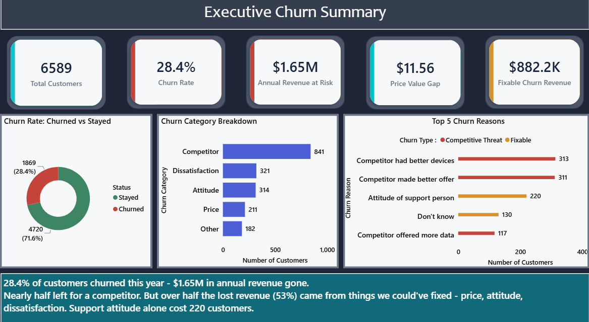
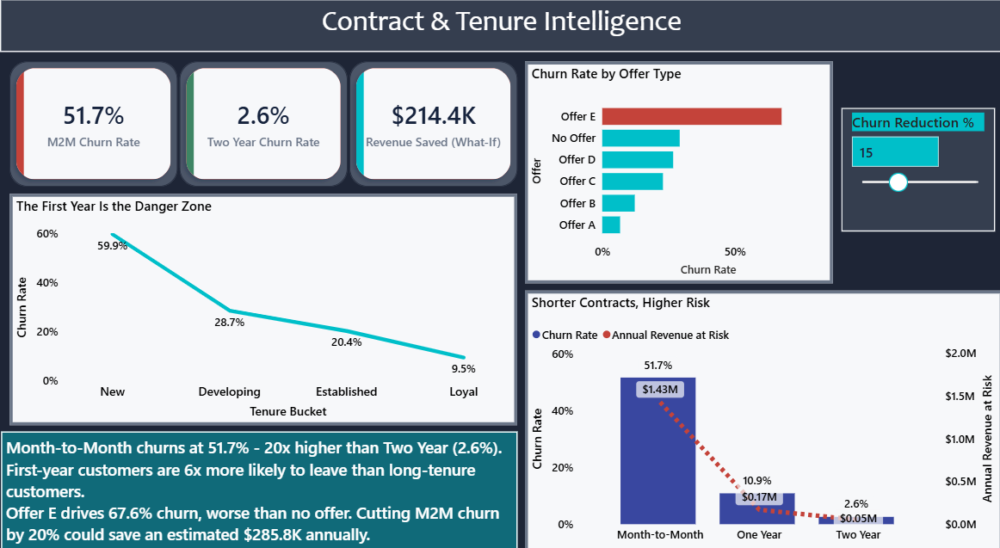
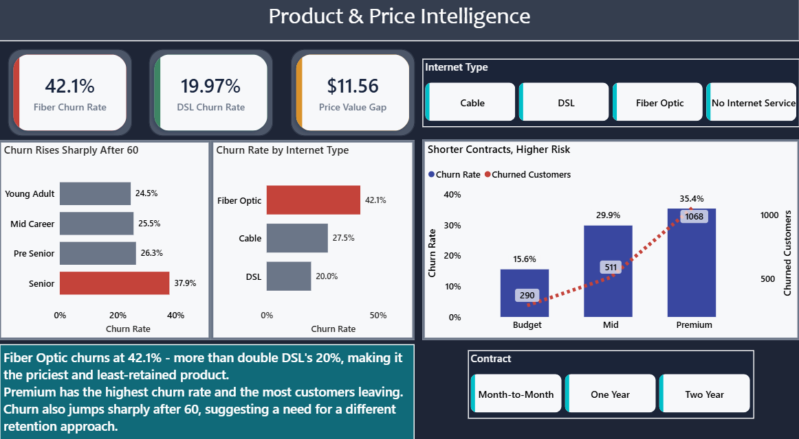
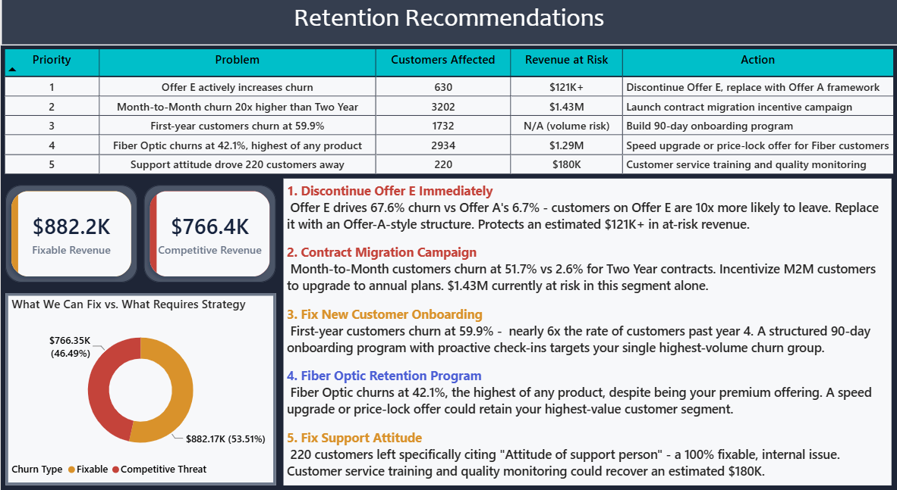

# Telecom Customer Churn & Revenue Intelligence

End-to-end churn analysis identifying revenue at risk and delivering data-backed retention recommendations, built with Python, MySQL, and Power BI.

**[View the full dashboard screenshots ↓](#7-dashboard-overview)** · 6,589 customers analyzed · $1.65M revenue at risk identified

---

## 1. Executive Summary

This project analyzes 6,589 telecom customers to answer a question most churn dashboards don't: not just *who* is leaving, but *why* — and how much of it the company could actually prevent. Using the dataset's unique `Churn Category` and `Churn Reason` fields, the analysis traces $1.65M in annual revenue loss back to specific, fixable causes, and separates what's within the company's control from what isn't. The result is a 4-page Power BI dashboard built for a retention, product, and pricing audience, backed by cleaned data, validated SQL, and a documented cleaning process.

**Key numbers:** 28.4% churn rate · $1.65M annual revenue at risk · 53.5% of that revenue tied to fixable causes · a 20x churn gap between Month-to-Month and Two-Year contracts.

---

## 2. Business Problem

Telecom is a recurring-revenue business — losing a customer doesn't just cost one month's bill, it costs every month that customer would have paid going forward. A 28.4% churn rate means roughly 1 in 4 customers didn't renew their relationship with the company this period, and replacing a lost customer typically costs far more than retaining one. Most churn analyses stop at "who churned." This project goes further: it identifies *why*, quantifies the revenue tied to each cause, and separates problems the company can fix internally from ones that require a different, more strategic response.

---

## 3. Data Source

Data provided by [Maven Analytics](https://www.mavenanalytics.io/) — a public dataset used for portfolio and learning purposes; raw files are included in this repo under `data/` for reproducibility, with full credit to Maven Analytics as the original source. Original file: 7,043 customers, 38 columns. Filtered to 6,589 customers with a `Customer Status` of Churned or Stayed (customers marked "Joined" were excluded, since they hadn't been active long enough to have a churn outcome). A supplementary zip-code population file was included for potential geographic/market-penetration analysis.

---

## 4. Tech Stack

| Tool | Purpose |
|---|---|
| **Python (pandas, matplotlib, seaborn)** | Data cleaning, feature engineering, exploratory analysis |
| **Jupyter Notebook** | Interactive analysis environment |
| **MySQL** | Structured querying and business-question validation |
| **Power BI** | 4-page interactive dashboard, DAX measures, What-If scenario modeling |

---

## 5. Data Cleaning

Full detail in `churn_analysis.ipynb`. Summary of what was found and fixed:

- **114 rows (1.7%) had negative `Monthly Charge` values** (range: -$1 to -$10). Investigation showed every other field on these rows (Total Charges, Total Revenue, Contract) was normal, pointing to a data export sign-error rather than corrupted records. Resolved with `.abs()`.
- **Missing values were structural, not broken** — confirmed by cross-checking (e.g., all 644 missing `Multiple Lines` values matched customers with `Phone Service = No`). Filled with descriptive labels (`"No Internet Service"`, `"No Offer"`, `"N/A - Stayed"`) rather than blanket zeros, to preserve meaning in later analysis.
- **6 new columns engineered:** `Churn_Flag` (binary, for rate calculations), `Tenure_Bucket`, `Age_Bucket`, `Charge_Tier` (segmentation), `Annual_Revenue_at_Risk` (Monthly Charge × 12 for churned customers only), and `Churn_Type` (Fixable vs. Competitive Threat, based on `Churn Category`).
- **One boundary correction caught by validation:** initial age bucket ranges (66–80 for "Senior") produced a churn rate that didn't match earlier findings. Cross-checking against a direct age-range query showed the correct cutoff was 61–80, not 66–80 — bins were corrected and re-verified.

---

## 6. Analysis

**Exploratory analysis (Python)** — 8 visualizations covering overall churn rate, root-cause breakdown by category and specific reason, contract type impact, tenure-based risk, offer performance, product (internet type) comparison, and price-value perception. Screenshots in `eda_analysis_screenshots/`.

**SQL analysis (MySQL)** — 10 business-question-driven queries covering revenue at risk, contract and product risk, fixable-vs-competitive split, offer ranking (using `RANK()`), win-back candidate targeting, and geographic concentration. Full queries with results and insights in `telecom_churn_queries.sql`. Screenshots in `sql_queries_screenshots/`.

Every number in the dashboard was cross-validated across Python, SQL, and Power BI before being finalized.

---

## 7. Dashboard Overview

Interactive 4-page Power BI dashboard (`telecom_churn.pbix`):

### Page 1 — Executive Churn Summary
Headline KPIs, churn category breakdown, and top 5 churn reasons color-coded by whether they're fixable or competitor-driven.



### Page 2 — Contract & Tenure Intelligence
Contract type risk, tenure-based churn curve, offer performance ranking, and an interactive What-If revenue simulator.



### Page 3 — Product & Price Intelligence
Internet type comparison, pricing tier risk (rate and volume), and age-group churn risk.



### Page 4 — Retention Recommendations
Priority action matrix, fixable vs. competitive revenue split, and 5 data-backed recommendations written as an executive strategy memo.



---

## 8. Key KPIs (DAX Measures)

| Measure | Logic |
|---|---|
| Churn Rate | `DIVIDE([Churned Customers], [Total Customers], 0)` |
| Annual Revenue at Risk | Sum of Monthly Charge × 12, churned customers only |
| Price Value Gap | Avg. Monthly Charge (Churned) − Avg. Monthly Charge (Retained) |
| Fixable Churn Revenue | Revenue at risk filtered to `Churn_Type = "Fixable"` |
| M2M / Two Year Churn Rate | Churn Rate filtered by Contract type |
| Revenue Saved (What-If) | Interactive parameter-driven scenario: M2M revenue at risk × user-selected reduction % |
| Fiber / DSL Churn Rate | Churn Rate filtered by Internet Type |

10 measures total, covering all 4 dashboard pages.

---

## 9. Key Findings

- **Churn rate:** 28.4% (1,869 of 6,589 customers)
- **Annual revenue at risk:** $1.65M
- **Month-to-Month churn:** 51.7%, vs. 2.6% for Two-Year contracts — a 20x gap
- **First-year churn:** 59.9%, dropping to 9.5% for customers past year 4
- **Offer E churn rate:** 67.6% — higher than customers given no offer at all (29.2%)
- **Competitor-driven churn:** 45% of all churned customers
- **Fixable vs. competitive revenue split:** 53.5% fixable, 46.5% competitive
- **Price-value gap:** churned customers paid $11.56/month more on average than retained customers
- **Fiber Optic churn:** 42.1% — the highest of any internet product, despite being the premium offering
- **Premium price tier:** highest churn rate (35.4%) *and* highest volume of churned customers (1,068 of 1,869)

---

## 10. Business Impact

If the top 5 recommendations below were implemented, the fixable portion of revenue at risk ($882K) represents a realistic recovery target — even a partial recovery (e.g., 50–60%) would represent several hundred thousand dollars in retained annual revenue, without requiring any pricing changes or product overhaul.

---

## 11. Recommendations

1. **Discontinue Offer E immediately** — it drives 67.6% churn, worse than giving no offer at all. Replace with an Offer-A-style structure (6.7% churn).
2. **Launch a contract migration campaign** — Month-to-Month churns at 20x the rate of Two-Year contracts. $1.43M is currently at risk in this segment alone.
3. **Build a 90-day onboarding program** — first-year customers churn at 59.9%, the single highest-volume churn group.
4. **Fiber Optic retention program** — a speed upgrade or price-lock offer for the highest-churning, highest-value product line.
5. **Fix support attitude** — 220 customers cited "Attitude of support person" as their reason for leaving, a fully fixable, internal issue representing ~$180K in recoverable revenue.

---

## 12. Limitations

- Data represents a single quarter snapshot — no time-series trend is available.
- `Offer` contents (A–E) are anonymized in the source data; specific offer terms are unknown, so recommendations focus on performance patterns rather than offer redesign.
- Geographic data is limited to California; findings on regional churn concentration may not generalize to other markets.
- Age, income, and other demographic fields are self-reported/estimated in the original dataset.

---

## 13. Future Improvements

- Build a machine learning churn-prediction model to flag at-risk customers proactively, rather than analyzing churn retrospectively.
- Publish the dashboard to Power BI Service for live, shareable access instead of static screenshots.
- Extend the analysis with time-series data, if a multi-quarter dataset becomes available.
- Adapt the framework to a different market (e.g., Indian telecom data) to test generalizability.

---

## Repository Structure

```
├── churn_analysis.ipynb              → Python cleaning & EDA (Jupyter)
├── telecom_churn_queries.sql         → MySQL queries with business insights
├── telecom_churn.pbix                → Power BI dashboard (4 pages)
├── cleaned_telecom_churn.csv         → Final cleaned dataset (output of notebook)
├── data/                             → Raw source files (Maven Analytics)
│   ├── telecom_customer_churn.csv
│   ├── telecom_data_dictionary.csv
│   └── telecom_zipcode_population.csv
├── eda_analysis_screenshots/         → 8 exploratory analysis charts
├── sql_queries_screenshots/          → 10 SQL query results
└── dashboard_screenshots/            → All 4 dashboard pages
```
